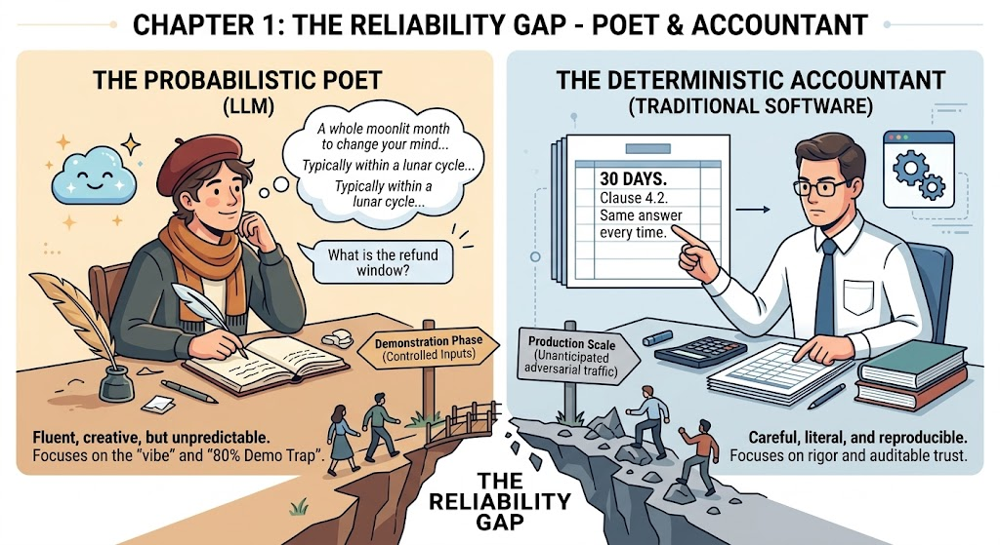

# Building Reliable AI-Assisted Software Systems

Code bundle for **_Building Reliable AI-Assisted Software Systems_** (Packt
Publishing) · **Author: Imran Ahmad**

Software has shifted from deterministic to probabilistic, opening a
reliability gap between the demo that almost works and the production system
that has to. You cannot make the model deterministic, but you can build a
deterministic shell around a probabilistic core; this repository is that
argument, executable, one chapter at a time.

<p align="center">
  
</p>

The picture above is the book's central metaphor, exactly as it appears in
Chapter 1 (*Figure 1.2*). The model is the **poet**: fluent, inventive, and
constitutionally incapable of balancing the books. Traditional software is
the **accountant**: careful, literal, reproducible, and auditable. In the
book's words: "you do not fix the poet, and you do not fire the poet. You
give the poet an accountant." Every chapter bundle in this repository builds
one more part of that accountant, as running code, around the same poet.

Every chapter folder is self-contained: its own notebook, requirements,
data, and tests, designed to run **fully offline with no API key**. Each
notebook prints a `SIMULATION MODE` banner on its first cell to confirm it;
an optional Live Mode (documented per chapter) points the same harness at a
real model.

## Chapters

| Folder | Chapter | Status |
| --- | --- | --- |
| `chapter-01-the-reliability-gap/` | 1 · The Reliability Gap | ready |
| `chapter-02-the-engineering-mindset-for-ai/` | 2 · The Engineering Mindset for AI | ready |
| `chapter-03-defining-correctness-and-golden-datasets/` | 3 · Defining Correctness and Golden Datasets | ready |

Further chapter folders land here as the book's parts are delivered.

## Quickstart (any chapter)

```bash
cd chapter-03-defining-correctness-and-golden-datasets
python -m venv .venv && source .venv/bin/activate
pip install -r requirements.txt
jupyter lab
```

Open the chapter notebook and **Run All**.

## License

MIT (see each chapter's `LICENSE`).
